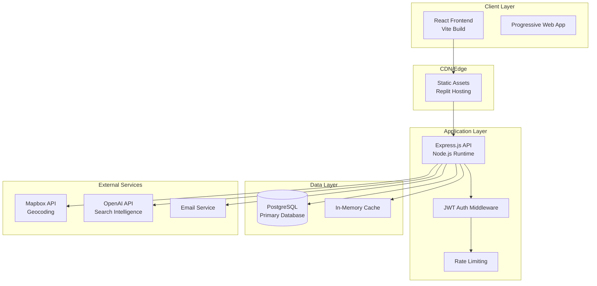

# BeeDab Real Estate Platform Architecture

## Overview
BeeDab is a comprehensive real estate marketplace built for the Botswana market, featuring property listings, auctions, services directory, and financial tools.

## System Architecture

## Runtime Services

### Core Services
- **Express API Server**: Port 5000, handles all API routes
- **Vite Development Server**: Hot reload for frontend development
- **PostgreSQL Database**: Primary data store on Replit

### Environment Configuration
- **Development**: Local PostgreSQL (via Docker compose) + Vite dev server
- **Production**: PostgreSQL + static build serving

## Data Stores

### Primary Database (PostgreSQL)
- Users, properties, rentals, services
- Indexes on search fields (city, propertyType, price)
- Coordinates for map display

### In-Memory Cache
- Search results caching
- User session data

## API Endpoints

### Core Endpoints
- `GET /api/health` - Health check
- `GET /api/properties` - Property listings with filtering
- `POST /api/properties` - Create new property (authenticated)
- `GET /api/properties/:id` - Property details
- `POST /api/users/login` - Authentication
- `POST /api/users/register` - User registration

### Protected Endpoints
All property mutations, user data access, and admin functions require JWT authentication.

## Security Measures

### Current Implementation
- Helmet security headers
- CORS configuration
- JWT authentication
- Rate limiting on auth endpoints
- Input validation with Zod schemas

### Required Enhancements
- Expanded rate limiting
- Structured logging
- Media validation
- Token refresh strategy

## Deployment Pipeline

### Build Process
1. Frontend: `npm run build` → static assets
2. Backend: TypeScript compilation
3. Database: Drizzle migrations

### Hosting
- **Platform**: Replit
- **Static Assets**: Served by Express in production
- **Database**: PostgreSQL on Replit
- **Domain**: Replit-provided URL with custom domain support

## Monitoring & Observability

### Logging
- Morgan HTTP request logging
- Console-based application logging
- Error boundary catching in React

### Health Checks
- Database connection validation
- API health endpoint
- Frontend build validation

## Compliance

### Data Protection
- User consent handling
- Botswana DPA compliance requirements
- Privacy policy implementation needed

### Security
- Content Security Policy
- HTTPS enforcement
- Secure JWT handling
